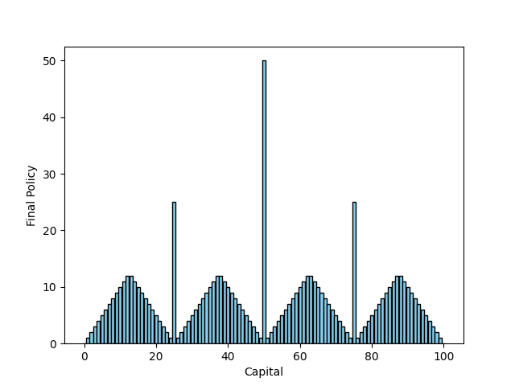

# Gambler's Problem

## Problem Statement

The problem statement of this assignment is to implement the Gambler's Problem as described in the book "Reinforcement Learning: An Introduction" by Richard S. Sutton and Andrew G. Barto.

hehe

This is simple, I just want you to analyse the optimal actions and try to reason with the results. They look good!

the logic behind the policy is to either increase your capital to 100 directly or bet a certain amount in which you can get to milestone numbers like 100 50 75 or 25
So for 50 we bet 50 for the chance to go to 100
at 25 we bet 25 to reach 50 and at 75 we bet 25 to reach 100
for the remaining number we bet enough such taht either when we lose of when we win we reach the nearest milestone number
